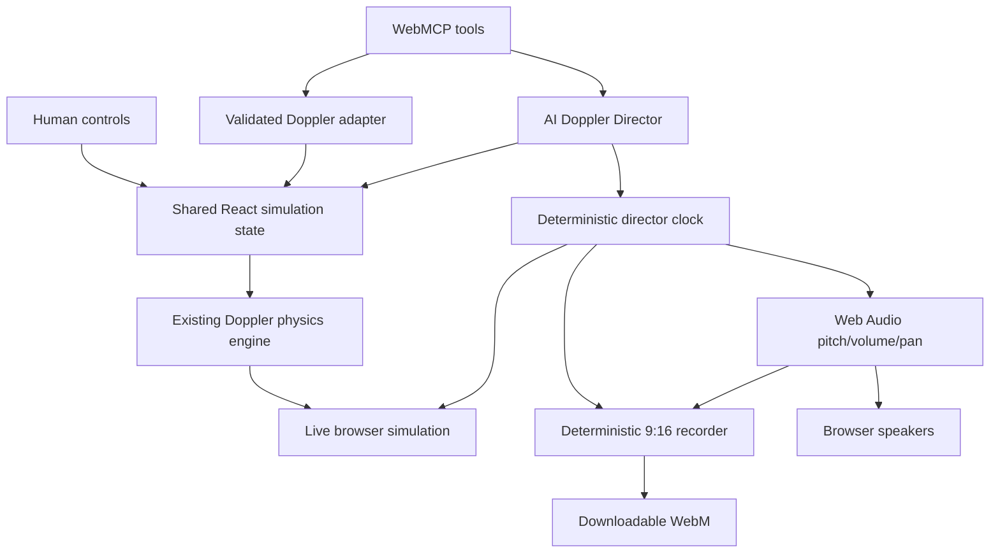

# WebMCP Architecture

## Design decision

WebMCP is a progressive enhancement over Esbiko's existing React application. It does not add a chatbot, duplicate the simulation, or drive the page through DOM clicks.



## Tool layers

### Site tools

`src/webmcp/WebMcpSiteTools.jsx` and `src/webmcp/siteTools.js` register two persistent tools:

- `list_science_simulations`
- `open_science_simulation`

The site registry advertises the verified Doppler capabilities: state read, semantic configuration, scene configuration, playback, reset, video director, video status, and video download.

### Doppler page tools

`Doppler/adapter/dopplerTools.js` defines nine page-scoped tools:

- state read;
- one-source semantic configuration;
- one/two-source explicit scene configuration;
- run/pause;
- reset;
- create video;
- video status;
- stop/finalize;
- download.

`Doppler/hooks/useDopplerWebMcp.js` registers them only while the Doppler page is mounted.

### Registration runtime

`src/webmcp/registerWebMcpTools.js` provides feature detection, sequential registration, `AbortSignal` lifecycle cleanup, and consistent JSON success/error envelopes. Unsupported browsers simply keep the normal Esbiko UI.

## Validated scientific boundary

`Doppler/adapter/dopplerAdapter.js` is the JSON-safe boundary between WebMCP and simulation state. It validates ranges, maps semantic motion to signed velocity, and returns measurements calculated by Esbiko's existing Doppler functions.

No LLM-generated frequency is written into the scientific result.

## AI Doppler Director

`Doppler/director/dopplerDirector.js` creates deterministic plans from explicit scientific parameters.

Supported story modes:

- `two_vehicle`: two sequential sources; each source has an approaching and receding phase.
- `single_pass`: one source for the entire recording, crossing the observer halfway through.

The director uses exact geometry:

```text
phase distance = source speed × phase duration
```

Application defaults are:

```json
{
  "storyMode": "two_vehicle",
  "durationSeconds": 30,
  "speedMps": 60,
  "emittedFrequencyHz": 440,
  "firstInstrument": "esbiko_voice",
  "secondInstrument": "ambulance_siren"
}
```

That produces a 7.5-second phase, 450-metre leg, and positions `50 → 500 → 950` followed by `950 → 500 → 50`.

The final production-verified judge/demo payload uses `car_engine` followed by `ambulance_siren` with the same geometry because those two real recordings produced the clearest audible before/after comparison.

## Shared director clock: browser, recorder, and AI audio

The recorder derives each frame from `createDopplerDirectorFrameSource(plan, elapsedSeconds)`. The live browser canvas derives its directed source from the same plan and elapsed director time while a recording is active.

The final synchronization fix also makes the AI-recorded audio derive its source state from that same deterministic director timeline. `useDopplerSimulation` detects an active director recording, anchors a monotonic clock to the director's elapsed time, generates the active source with `createDopplerDirectorFrameSource(...)`, then applies the resulting Doppler frequency, volume, and stereo pan to the Web Audio voice.

This matters because a 1080×1920 canvas plus WebM encoding can reduce browser frame cadence. If audio were integrated with a second independent simulation clock, the visual source could pass the observer before the audible pitch switched from approaching to receding. The shared director clock removes that drift.

For the final 30-second story, visual and audible pass transitions are therefore tied to the same exact planned times:

- vehicle 1: `7.5 s`;
- vehicle 2: `22.5 s`.

When the story switches from vehicle 1 to vehicle 2, inactive AudioVoice instances are explicitly stopped so the previous sample does not overlap the next source.

Outside an active director recording, normal manual playback continues to use the ordinary simulation physics loop.

## Audio architecture

Selected real recordings are preloaded before the recorder starts. The graph is:

```text
AudioVoice(s)
   ↓
master gain
   ↓
analyser
   ├──→ browser speakers
   └──→ MediaStreamDestination → WebM recorder
```

The director does an audio preflight before recording. If the browser `AudioContext` is not running, it returns `AUDIO_ACTIVATION_REQUIRED`. If no measurable signal reaches the analyser within the verification window, it returns `AUDIO_SIGNAL_MISSING` and does not create a silent file.

The preflight is reset to exact `t=0` before MediaRecorder begins, so audio motion does not consume part of the recorded timeline.

## Doppler sound behavior

The scientific measurement uses Esbiko's Doppler equation. For real audio samples, the observed/emitted frequency ratio is applied to the sample `playbackRate`, creating the audible higher pitch while approaching and lower pitch while receding.

The scientific display keeps the existing intensity model. Audible real-sample gain uses an acoustic-pressure-style distance falloff so distant vehicles remain hearable while still becoming louder near the observer.

## Recording architecture

The in-page recorder creates a 1080×1920 (`9:16`) canvas stream and combines it with the verified Web Audio capture track. It renders the city scene, observer, vehicle, wavefronts, scientific measurements, captions, phase information, and recording progress.

The WebMCP status tool exposes recording state, elapsed time, phase, timeline, expected frequency comparison, audio track presence, audio signal verification, file size, and download readiness.

## Security decisions

- Only a public educational simulation is exposed.
- No account, classroom, admin, or private-user-data actions are WebMCP tools.
- Inputs use strict schemas and are validated again inside domain adapters/director code.
- Tool callers cannot select arbitrary routes, DOM nodes, functions, or URLs.
- Read operations use `readOnlyHint: true`; mutations use `false`.
- Tools remain same-origin and page-scoped where appropriate.
- Browser audio activation failures are explicit rather than bypassed.
