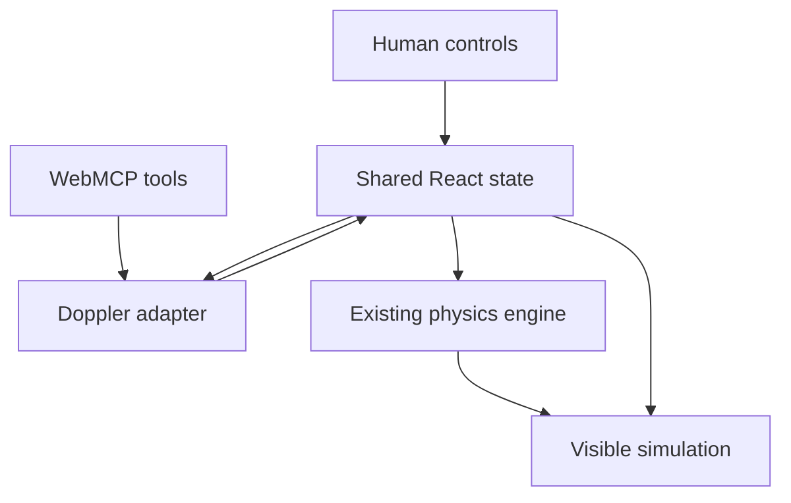

# WebMCP Architecture

## Design decision

WebMCP is a progressive enhancement over Esbiko's existing React application. It does not introduce a backend, agent framework, duplicate simulation, or DOM automation layer.

## Layers

### Site tools

`src/webmcp/WebMcpSiteTools.jsx` registers persistent site-level discovery and navigation tools inside the router.

`src/webmcp/siteTools.js` owns the tool contracts and the deliberately small allowlist of simulations verified for WebMCP.

### Registration runtime

`src/webmcp/registerWebMcpTools.js` provides:

- feature detection for `document.modelContext`;
- sequential tool registration;
- `AbortSignal` lifecycle cleanup;
- consistent JSON success and error envelopes.

Unsupported browsers receive no polyfill and the existing application continues normally.

### Doppler adapter

`Doppler/adapter/dopplerAdapter.js` is the JSON-safe domain boundary. It validates parameter types and bounds, maps semantic motion such as `approaching` to the correct signed source velocity, and calculates measurements through the existing `dopplerPhysics.js` functions.

It does not import React, DOM nodes, canvas objects, audio contexts, or mutable browser objects.

### Doppler tools

`Doppler/adapter/dopplerTools.js` defines four non-overlapping page tools with JSON Schema inputs, concise descriptions, annotation hints, and output budgets.

`Doppler/hooks/useDopplerWebMcp.js` registers those tools only while the Doppler simulation is mounted and removes them when it unmounts.

### Shared state

`Dopplersimulator.jsx` remains the state owner. Both human UI handlers and WebMCP adapter actions update `mode`, `isRunning`, `observer`, and `sources`. The adapter reads the latest state through refs so a manual slider change is immediately visible to the next agent state read.

## Scientific integrity

The state tool distinguishes configuration from calculated measurements. Observed frequency, frequency ratio, shift percentage, motion classification, relative amplitude, and level are recalculated from the existing Esbiko physics functions. No LLM-generated number is written into the simulation result.

## Security decisions

- Only a public educational simulation is exposed; no account, classroom, admin, or user-data tools are registered.
- All writes use strict schemas and repeat validation inside the adapter.
- Tool inputs cannot select arbitrary routes, DOM nodes, functions, URLs, or object properties.
- Read tools set `readOnlyHint: true`; mutating tools set it to `false`.
- Outputs contain no user-generated or external content and set `untrustedContentHint: false`.
- Tools remain same-origin and do not use `exposedTo` for cross-origin sharing.
- Descriptions, parameter descriptions, names, and results stay within current Chrome security-guide budgets.

## Audio behaviour

WebMCP playback starts the visual/physics loop without forcing an `AudioContext` activation. Browsers commonly require a direct human gesture before audio playback. A human can click the visible Run button to enable sound; this does not affect state, measurement, or WebMCP correctness.
